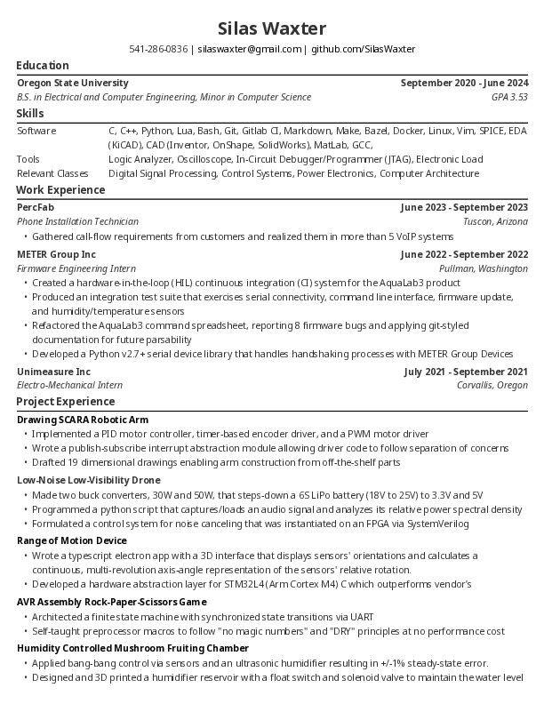

# About

This is an image of my resume. See below for discussion on how and why its
written in AsciiDoc.

## What/Why write it like this?

I believe in [docs-as-code](https://www.writethedocs.org/guide/docs-as-code/).
[AsciiDoc](https://asciidoc.org/) is a plain-text markup language that sits
between markdown and LaTex. It has an official specification unlike markdown
which means you don't have to worry about variants like you do with markdown.
Furthermore, it was created with the notion that the markup language should be
fast/readable like markdown; however, it includes many of the popular markdown
extras/add-ons out of the box. Theming of the document is simple and is
controlled parametrically with a `.yaml` file. I think its pretty cool.
